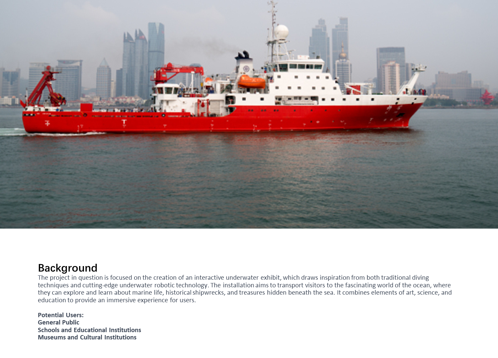
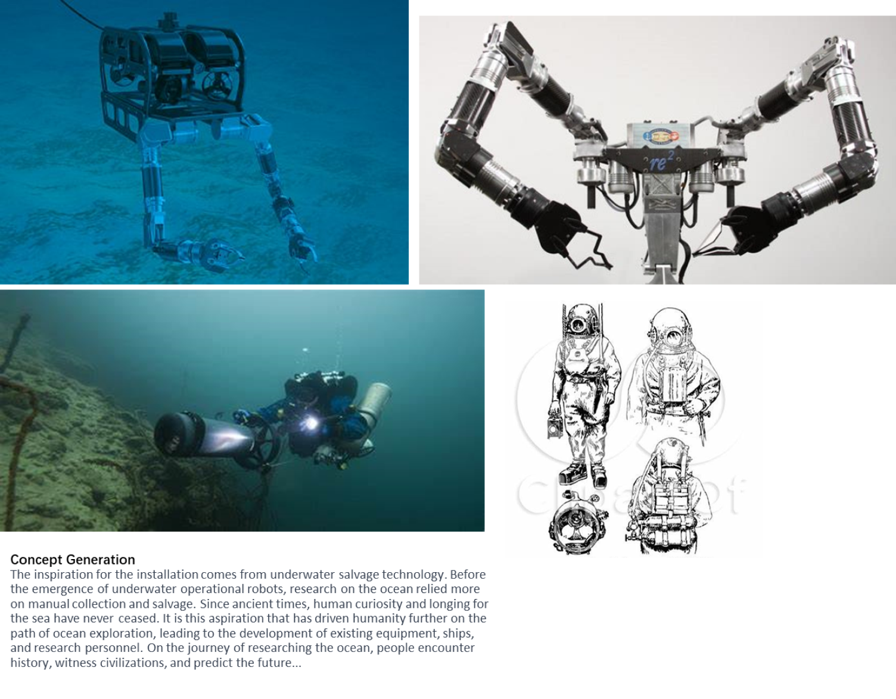
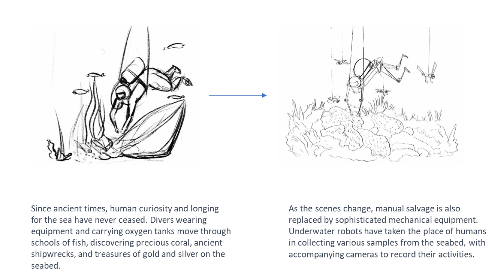
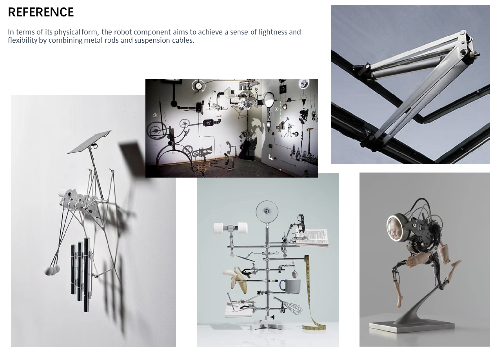
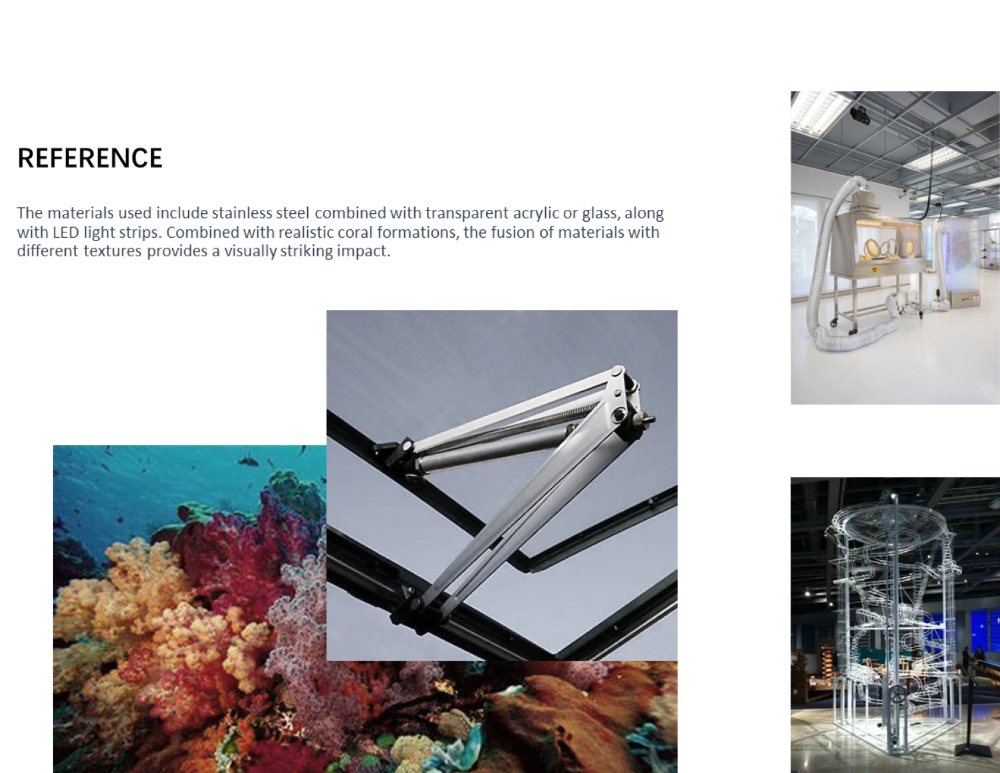
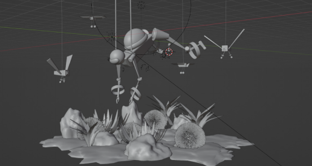
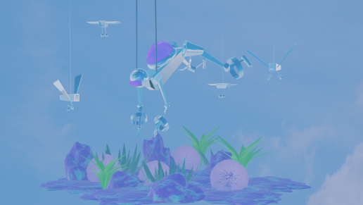

# Underwater-Scene

**Concept Design by Xinyi Dong**  
_DALI Lab Job Application – Winter 2024_

---

*Brainstorming & Ideation (3 Hours)  
*Modeling (3 Hours)
*Rendering (3 Hours) 

---

## **Concept Art & Renders**

  
  
  
  
  
  
  

<!--
  
 

-->
---

## **Final Thoughts**
This project was completed within a **9-hour time frame**, pushing the boundaries of rapid ideation, modeling, and rendering. It is a visual representation of how human curiosity can extend beyond land into the depths of the ocean.

